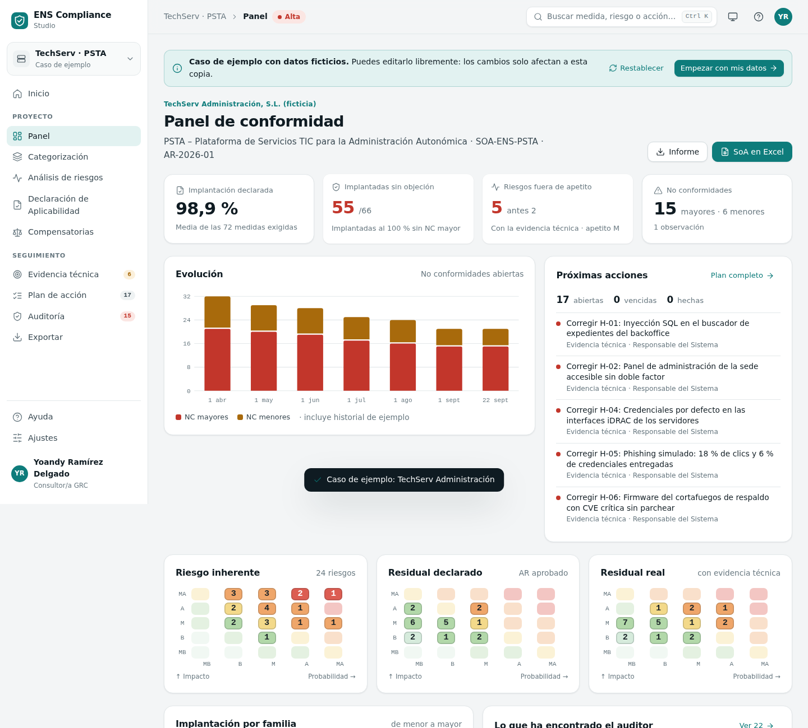
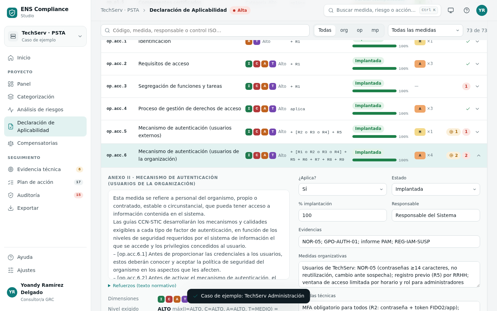
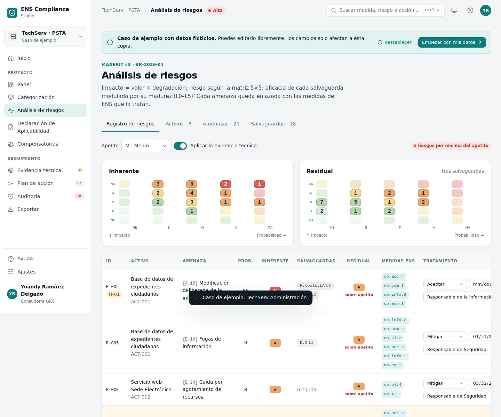
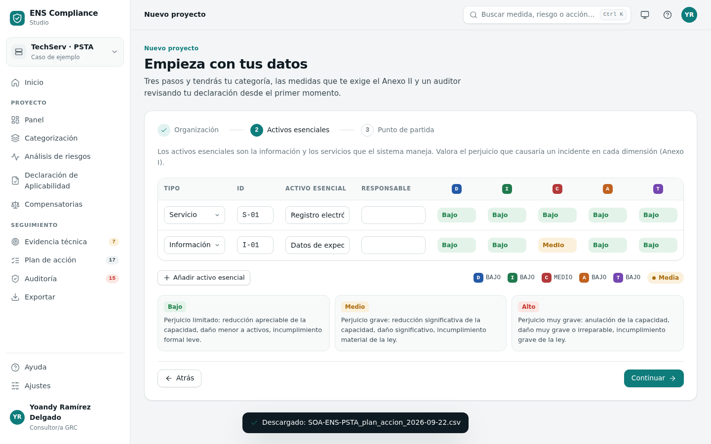
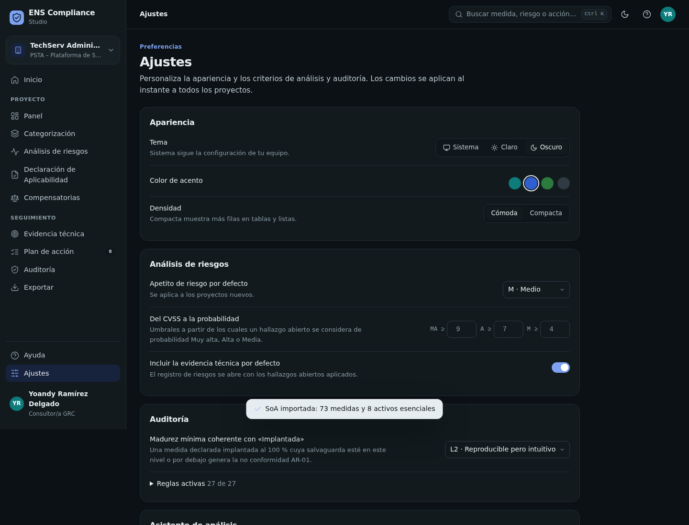

# ENS Compliance Studio

Categorización, análisis de riesgos MAGERIT, Declaración de Aplicabilidad y preauditoría del Esquema Nacional de Seguridad.

Es una sola herramienta, y cabe en un fichero.



> Proyecto de fin de máster · Máster en Ciberseguridad & IA (Evolve Academy) · Módulo de Gobierno, Riesgo y Cumplimiento
> Autor: **Yoandy Ramírez Delgado** · Septiembre de 2026 · Versión 2.0.1

---

## Por qué existe

Quien presta servicios al sector público en España tiene que cumplir el ENS (RD 311/2022), y para eso mantiene tres documentos que deberían contar la misma historia:

1. La **categorización** del sistema (art. 40), que fija el nivel exigido a cada una de las 73 medidas del Anexo II.
2. El **análisis de riesgos** (art. 14), normalmente con MAGERIT y PILAR.
3. La **Declaración de Aplicabilidad (SoA)** (art. 28), que dice qué medidas se aplican, cómo y con qué evidencias.

Viven en ficheros distintos, los mantienen personas distintas y se desalinean sin que nadie lo note. Hay además un cuarto documento que casi nunca se cruza con los otros tres: **el informe de pentest**.

ENS Compliance Studio los concilia y señala lo que no cuadra antes de que lo haga el auditor de certificación.

## Qué hace

| | |
|---|---|
| **Categorización en vivo** | Valora los activos esenciales y obtén al momento la categoría, el nivel exigido, la exigencia y los refuerzos de las 73 medidas. |
| **Análisis de riesgos MAGERIT** | Activos, amenazas, salvaguardas con madurez L0–L5, riesgo inherente y residual, apetito y tratamiento. Usa las mismas fórmulas que el MAGERIT Lab de clase, verificadas contra su código original. |
| **SoA viva** | Las 73 medidas con el texto del Anexo II, la equivalencia con ISO/IEC 27001:2022 y, para cada medida, los riesgos que trata, las salvaguardas que la implementan, los hallazgos abiertos y lo que objeta el auditor. |
| **Evidencia técnica** | Los hallazgos de pentest, escaneos y phishing (CSV o JSON) se convierten en riesgo MAGERIT y se contrastan con lo declarado. |
| **Auditor de 27 reglas** | No conformidades mayores y menores y observaciones, con referencia normativa y acción recomendada. Las reglas se pueden configurar. |
| **Plan de acción** | Las no conformidades, los riesgos fuera de apetito y los hallazgos se convierten en tareas con responsable y fecha. Cuando el origen desaparece, la tarea queda verificada. |
| **Proyectos propios** | Asistente en tres pasos, o importación directa de tu SoA en Excel. |
| **5 casos de ejemplo** | TechServ (ALTA), un ayuntamiento (MEDIA), una universidad (MEDIA), un hospital (ALTA) y un SaaS (BÁSICA), cada uno con problemas distintos que descubrir. |
| **Exportación** | SoA en Excel con la estructura de la plantilla y la trazabilidad añadida, informe de preauditoría en Markdown, plan de acción y registro de riesgos en CSV, y el proyecto en JSON. |
| **Hecha para el uso diario** | Buscador de comandos (Ctrl + K), atajos de teclado, perfil, ajustes, tema claro y oscuro con paneles translúcidos, seis acentos (verde agua, azul, verde, amarillo, rojo y grafito), interfaz en español e inglés, densidad compacta, centro de ayuda con glosario, copia de seguridad y diseño responsive. |
| **Auditor por línea de comandos** | `ens_soa_audit.py` audita cualquier SoA en Excel con la plantilla, apto para CI. |

<table><tr>
<td></td>
<td></td>
</tr><tr>
<td></td>
<td></td>
</tr></table>

## Empezar

```bash
# 1. Abrir la aplicación (sin instalar nada; funciona sin conexión)
open app/dist/ens-compliance-studio.html        # Windows: start app\dist\ens-compliance-studio.html

# 2. Auditar una SoA en Excel desde la terminal
pip install openpyxl
python3 auditor/ens_soa_audit.py data/SoA_TechServ_original.xlsx --md informe.md
python3 auditor/ens_soa_audit.py mi_SoA.xlsx --fail-on mayor      # código 2 si hay NC mayores

# 3. Reconstruir desde las fuentes (Node ≥ 18)
node app/build.js

# 4. Ejecutar todas las pruebas (Node, Python 3.10+, pytest, Playwright)
./run_tests.sh
```

## Lo que encuentra en el caso de clase

Sobre el Excel y el MAGERIT Lab del profesor, tal cual se entregaron:

- **1 cabecera corrupta** en la hoja SoA (columna O). La disponibilidad de S-01 y S-04 viene abreviada como `m`: se lee como MEDIO y no cambia la categoría, porque I-04 ya es ALTO.
- **4 contradicciones entre la SoA y el análisis de riesgos**: medidas declaradas implantadas al 100 % cuyas salvaguardas el análisis valora en madurez L2.
- Con seis hallazgos de pentest de ejemplo: **11 no conformidades mayores** por evidencia técnica, los riesgos fuera de apetito pasan **de 2 a 5**, y solo **55 de 66** medidas «implantadas» quedan sin objeciones.

## Seguridad

Se asume que cualquier fichero importado puede ser hostil. Resumen (detalle en [SECURITY.md](SECURITY.md)):

- Validación por esquema de todo lo que entra: proyectos, copias, Excel, CSV, `localStorage` y respuestas del asistente. Se aplican listas blancas, límites de longitud y de tamaño, identificadores filtrados y números acotados.
- Salida siempre escapada. Nunca se inserta HTML procedente de datos.
- Protección contra prototype pollution: claves bloqueadas y `Object.prototype` congelado. Mitiga la CVE-2023-30533 de SheetJS CE ≤ 0.19.2 al leer ficheros manipulados.
- Neutralización de fórmulas en CSV (CSV injection) y de HTML en los informes Markdown.
- CSP estricta en la versión autónoma: `connect-src 'none'`, es decir, la página no puede enviar datos a ningún sitio.
- Pruebas de ataque automatizadas: XSS, prototype pollution, fórmulas maliciosas, `localStorage` manipulado y ficheros sobredimensionados.

## Calidad

| Suite | Herramienta | Comprobaciones | Qué demuestra |
|---|---|---|---|
| Motor | `node --test` | 15 | Paridad con el Excel (73 medidas e indicadores) y con **el código original de MAGERIT Lab**; los 5 casos; ajustes; plan de acción. |
| Aplicación | Playwright | 61 | Flujo completo en navegador, importación del Excel del profesor, exportaciones, seguridad y diseño responsive a 390 y 768 px. |
| Auditor CLI | pytest | 9 | Resultado exacto sobre el Excel original, mutaciones controladas y **paridad Python ↔ JavaScript**. |

## Estructura

```
app/
  src/engine.js          motor puro (sin DOM): categorización, MAGERIT, SoA, auditor, plan de acción
  src/ui/*.js            interfaz por módulos: núcleo, seguridad, iconos, shell, vistas, E/S, eventos
  src/styles.css         sistema de diseño (tokens, tema claro/oscuro, acentos, densidad, responsive)
  cases/                 textos genéricos de implantación y los 4 casos de ejemplo adicionales
  build.js               genera dist/: versión autónoma (sin conexión, con CSP) y versión web alojada
  vendor/                xlsx-js-style 1.2.0 (Apache-2.0)
auditor/                 ens_soa_audit.py + anexo_ii.json
data/                    material del profesor (sin modificar) y tablas de trazabilidad
tests/                   engine.test.js · test_auditor.py · e2e_app.py
docs/                    memoria (.docx y .md), guion de la defensa y capturas
```

## Limitaciones

- Las correspondencias amenaza/salvaguarda ↔ medida ENS (`data/mapping.json`) son criterio del autor, razonado a partir de MAGERIT v3 y la CCN-STIC 804. Para un sistema real hay que revisarlas.
- El auditor no infiere equivalencias entre refuerzos (por ejemplo, que R2 «formal» de [op.pl.1] cubra R1 «semiformal»).
- Los datos se guardan en el navegador. Para trabajo en equipo haría falta un servidor con control de acceso.
- No sustituye a PILAR ni a la auditoría formal del art. 31: es una herramienta de preauditoría.

## Licencia

Código bajo licencia [MIT](LICENSE). `xlsx-js-style` bajo Apache-2.0. Los casos de ejemplo son ficticios. Texto normativo: RD 311/2022 (BOE-A-2022-7191).
