<p align="center">
  <picture>
    <source media="(prefers-color-scheme: dark)" srcset="docs/assets/readme/cabecera-dark.svg">
    
  </picture>
</p>

<p align="center">
  <b>Categorización, análisis de riesgos MAGERIT, Declaración de Aplicabilidad y preauditoría del ENS en un solo fichero HTML, sin servidor.</b>
</p>

<p align="center">
  <a href="https://heindall92.github.io/grc_ens_compliance_studio/app/dist/ens-compliance-studio.html"></a>
</p>

<p align="center">
  <a href="https://github.com/heindall92/grc_ens_compliance_studio/actions/workflows/tests.yml"></a>
  <a href="LICENSE"></a>
  
  
  
  
  
</p>

<p align="center">
  <picture>
    <source media="(prefers-color-scheme: dark)" srcset="docs/assets/readme/cifras-dark.svg">
    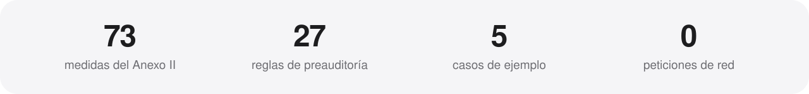
  </picture>
</p>

<p align="center">
  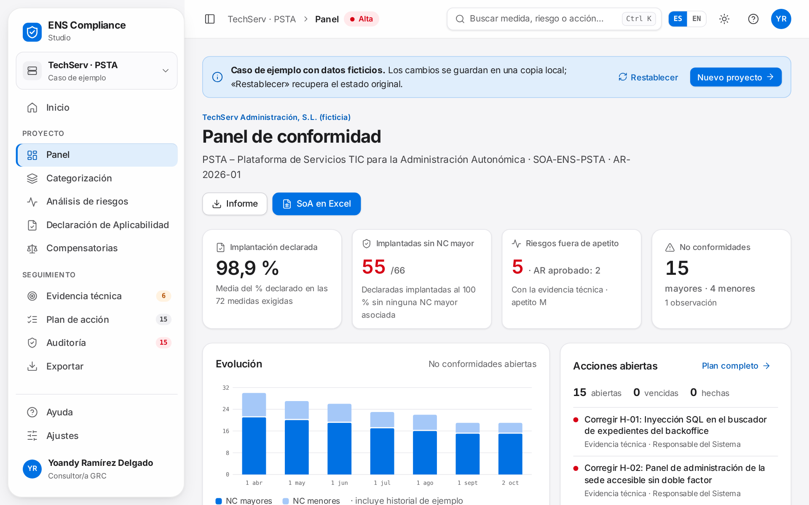
</p>

Quien presta servicios al sector público en España tiene que cumplir el ENS (RD 311/2022). Para eso mantiene tres documentos que deberían contar lo mismo:

- la **categorización** del sistema (Anexo I), que fija el nivel exigido a cada una de las 73 medidas del Anexo II;
- el **análisis de riesgos** (art. 14), normalmente con MAGERIT;
- la **Declaración de Aplicabilidad** (art. 28), que dice qué medidas se aplican, cómo y con qué evidencias.

Viven en ficheros distintos, los mantienen personas distintas y se desalinean sin que nadie lo note. Un cuarto documento casi nunca se cruza con ellos: **el informe de pentest**. ENS Compliance Studio los concilia y señala lo que no cuadra antes de la auditoría de certificación.

Es un único fichero HTML. Funciona sin conexión, no tiene servidor y no hace ninguna petición de red.

<div align="center">

## `$ cat ens-studio.yaml`

<table>
  <thead>
    <tr>
      <th colspan="2" align="left"><code>ens-studio:~$ cat ens-studio.yaml</code></th>
    </tr>
  </thead>
  <tbody>
    <tr>
      <td width="50%" valign="top"><code>├─ normativa:</code><br><br>
        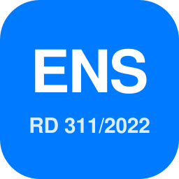
        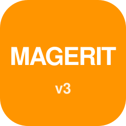
        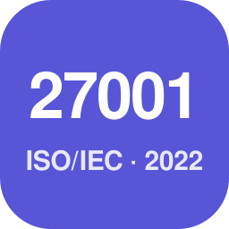
        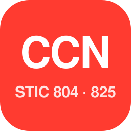<br>
        <sub><code>73 medidas · refuerzos R1…Rn · equivalencia ISO/IEC 27001 (CCN-STIC 825)</code></sub>
      </td>
      <td width="50%" valign="top"><code>├─ motor:</code><br><br>
        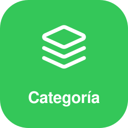
        
        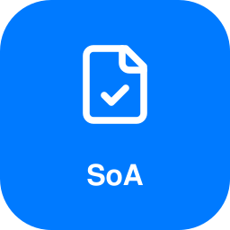
        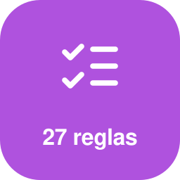
        <br>
        <sub><code>categoría · riesgo inherente y residual · SoA · 27 reglas · plan de acción</code></sub>
      </td>
    </tr>
    <tr>
      <td valign="top"><code>├─ codigo:</code><br><br>
        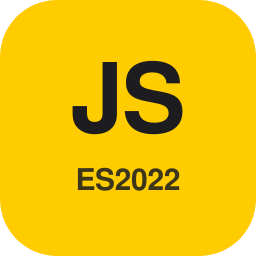
        
        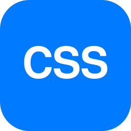
        
        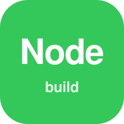<br>
        <sub><code>JavaScript sin frameworks · auditor CLI en Python · build con Node, sin npm</code></sub>
      </td>
      <td valign="top"><code>├─ pruebas:</code><br><br>
        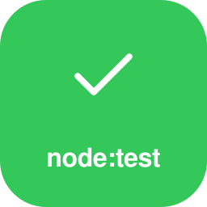
        
        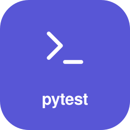
        <br>
        <sub><code>motor 15 · navegador 98 · auditor 11 · axe-core 0 infracciones</code></sub>
      </td>
    </tr>
    <tr>
      <td valign="top"><code>├─ seguridad:</code><br><br>
        
        
        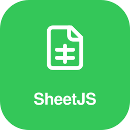
        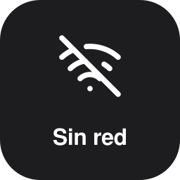<br>
        <sub><code>CSP por hashes · SRI · SheetJS 0.20.3 · connect-src 'none'</code></sub>
      </td>
      <td valign="top"><code>╰─ publicacion:</code><br><br>
        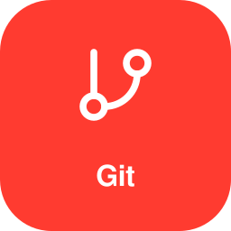
        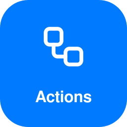
        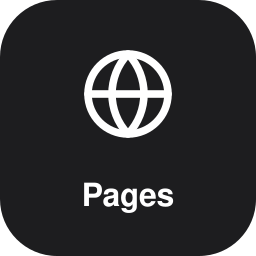<br>
        <sub><code>CI con acciones fijadas por SHA · GitHub Pages</code></sub>
      </td>
    </tr>
  </tbody>
  <tfoot>
    <tr>
      <td colspan="2"><code>version: 2.2.0&nbsp;&nbsp;·&nbsp;&nbsp;casos: 5&nbsp;&nbsp;·&nbsp;&nbsp;idiomas: es, en&nbsp;&nbsp;·&nbsp;&nbsp;licencia: MIT</code></td>
    </tr>
  </tfoot>
</table>

</div>

---

## Índice

- [Cómo se usa](#-cómo-se-usa)
- [Mapa mental](#-mapa-mental)
- [Vistas](#-vistas)
- [Capturas](#-capturas)
- [Lo que encuentra en el caso de clase](#-lo-que-encuentra-en-el-caso-de-clase)
- [Arranque rápido](#-arranque-rápido)
- [Calidad](#-calidad)
- [Seguridad y privacidad](#-seguridad-y-privacidad)
- [Estructura](#-estructura)
- [Limitaciones](#-limitaciones)
- [Licencia](#-licencia)
- [Autor](#-autor)

---

##  Cómo se usa

1. **Punto de partida.** Un proyecto nuevo con el asistente de tres pasos, la SoA que ya tienes en Excel (plantilla de 73 medidas) o uno de los cinco casos de ejemplo.
2. **Categorización.** Valoras los activos esenciales en las cinco dimensiones (D, I, C, A, T) y la herramienta calcula la categoría, el nivel exigido de cada medida y los refuerzos.
3. **Riesgos.** Activos, amenazas del catálogo MAGERIT y salvaguardas con madurez L0–L5. Riesgo inherente y residual, apetito y tratamiento.
4. **SoA y evidencia técnica.** Estado, evidencias y responsable de cada medida. Los hallazgos de pentest, escaneos y phishing (CSV o JSON) se convierten en riesgo y se contrastan con lo declarado.
5. **Preauditoría y plan.** 27 reglas detectan no conformidades e incoherencias. Cada una genera una acción con responsable y fecha, que se verifica sola cuando desaparece su origen.
6. **Entrega.** SoA en Excel con la estructura de la plantilla, informe de preauditoría en Markdown, plan y registro de riesgos en CSV, y el proyecto en JSON.

##  Mapa mental

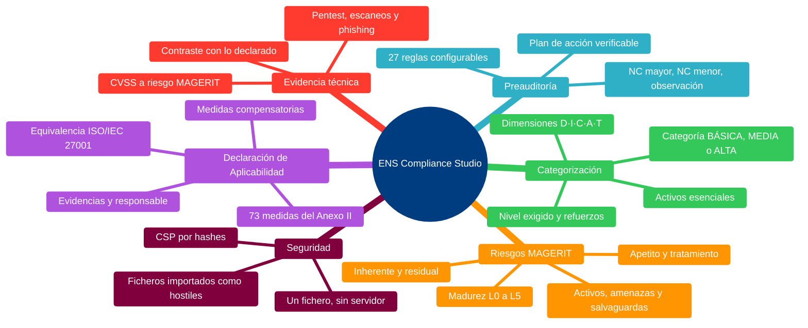
```mermaid
%%{init: {"theme": "base", "themeVariables": {"fontFamily": "-apple-system, BlinkMacSystemFont, Segoe UI, Helvetica, Arial, sans-serif", "primaryColor": "#007AFF", "primaryTextColor": "#FFFFFF", "lineColor": "#8E8E93", "cScale0": "#007AFF", "cScale1": "#34C759", "cScale2": "#FF9500", "cScale3": "#AF52DE", "cScale4": "#FF3B30", "cScale5": "#30B0C7", "cScaleLabel0": "#FFFFFF", "cScaleLabel1": "#FFFFFF", "cScaleLabel2": "#FFFFFF", "cScaleLabel3": "#FFFFFF", "cScaleLabel4": "#FFFFFF", "cScaleLabel5": "#FFFFFF"}}}%%
mindmap
  root((ENS Compliance Studio))
    Categorización
      Activos esenciales
      Dimensiones D·I·C·A·T
      Categoría BÁSICA, MEDIA o ALTA
      Nivel exigido y refuerzos
    Riesgos MAGERIT
      Activos, amenazas y salvaguardas
      Madurez L0 a L5
      Inherente y residual
      Apetito y tratamiento
    Declaración de Aplicabilidad
      73 medidas del Anexo II
      Evidencias y responsable
      Medidas compensatorias
      Equivalencia ISO/IEC 27001
    Evidencia técnica
      Pentest, escaneos y phishing
      CVSS a riesgo MAGERIT
      Contraste con lo declarado
    Preauditoría
      27 reglas configurables
      NC mayor, NC menor, observación
      Plan de acción verificable
    Seguridad
      Un fichero, sin servidor
      CSP por hashes
      Ficheros importados como hostiles
```

##  Vistas

| | Vista | Contenido |
|:-:|---|---|
|  | **Panel** | Implantación declarada, medidas implantadas sin no conformidades mayores, riesgos fuera de apetito, no conformidades, evolución y acciones abiertas. |
|  | **Categorización** | Valoración de cada activo esencial por dimensión con su justificación. La categoría y los niveles se recalculan al cambiar un valor. |
|  | **Análisis de riesgos** | Activos, amenazas, salvaguardas y registro de riesgos con mapas de calor inherente y residual. Usa las fórmulas del MAGERIT Lab de clase, verificadas contra su código. |
|  | **Declaración de Aplicabilidad** | Las 73 medidas con el texto del Anexo II, la exigencia por nivel y, en cada una, los riesgos que trata, las salvaguardas que la implementan, los hallazgos abiertos y las incidencias de la preauditoría. |
|  | **Compensatorias** | Fichas con la medida o refuerzo sustituido, el riesgo, las medidas que lo compensan, la validación, el mantenimiento y la aprobación. |
|  | **Evidencia técnica** | Hallazgos importados en CSV o JSON, con categoría, CVSS, activo afectado y estado. |
|  | **Plan de acción** | Una acción por no conformidad, riesgo fuera de apetito y hallazgo abierto, con responsable, fecha y verificación automática del cierre. |
|  | **Auditoría** | Resultado de las 27 reglas con referencia normativa y acción recomendada. Las reglas se activan o desactivan en Ajustes. |
|  | **Exportar** | SoA en Excel, informe en Markdown, plan y riesgos en CSV, proyecto en JSON. |

Además: buscador de comandos (`Ctrl + K`), atajos de teclado, perfil del autor de los informes, ajustes de criterios y reglas, centro de ayuda con glosario, copia de seguridad, tema claro y oscuro, seis acentos e interfaz en español e inglés.

##  Capturas

<table>
<tr>
<td width="50%">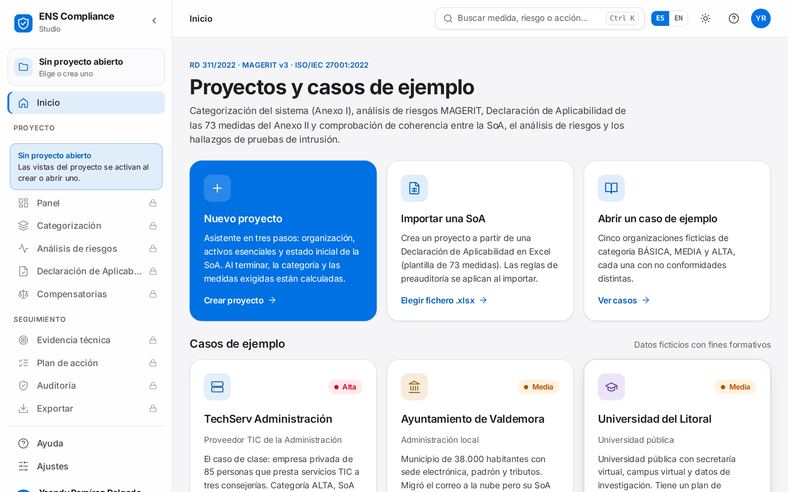<br/><sub><b>Inicio</b> · sin proyecto, las vistas del proyecto aparecen con candado y una nota</sub></td>
<td width="50%">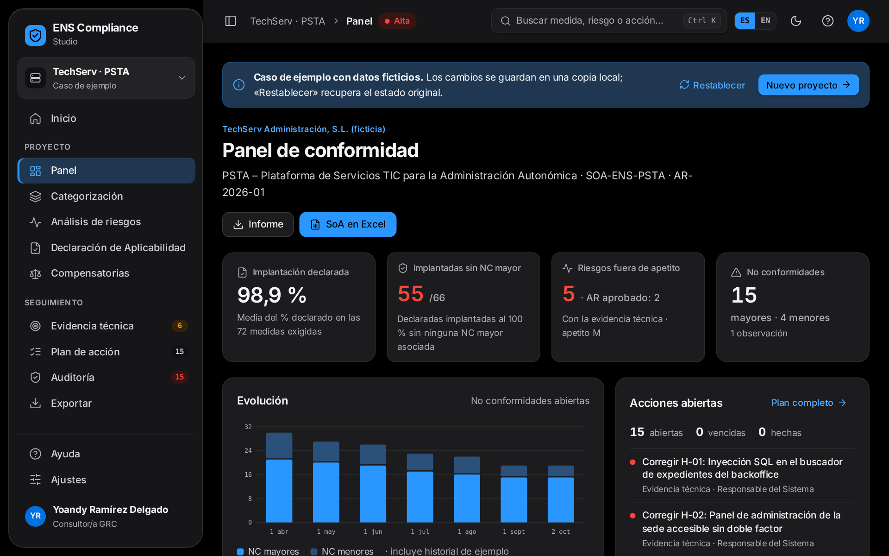<br/><sub><b>Panel</b> · tema oscuro</sub></td>
</tr>
<tr>
<td>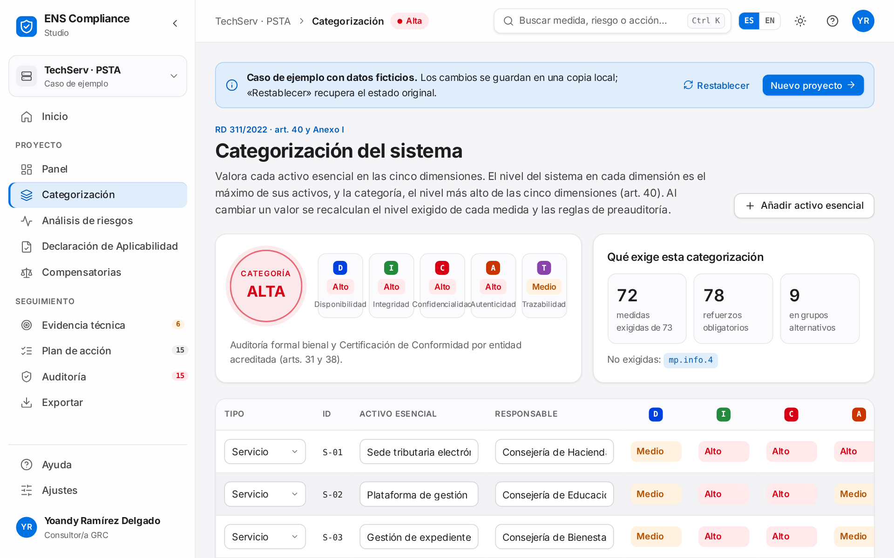<br/><sub><b>Categorización</b> · activos esenciales y categoría resultante</sub></td>
<td>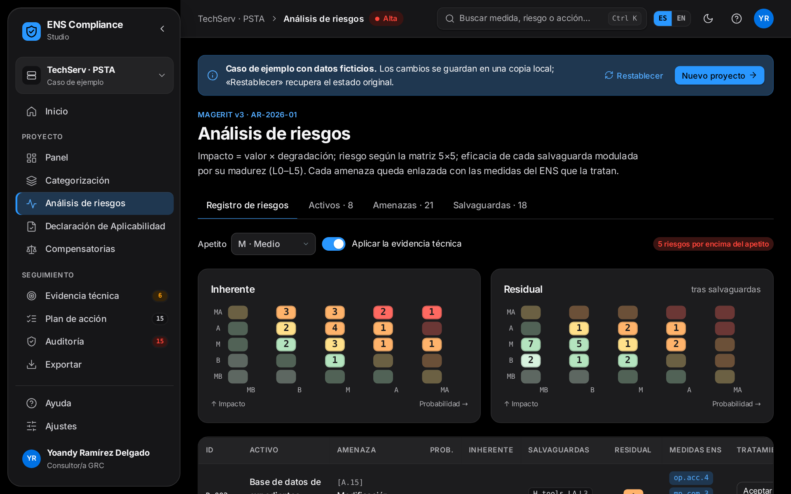<br/><sub><b>Análisis de riesgos</b> · mapas de calor inherente y residual</sub></td>
</tr>
<tr>
<td>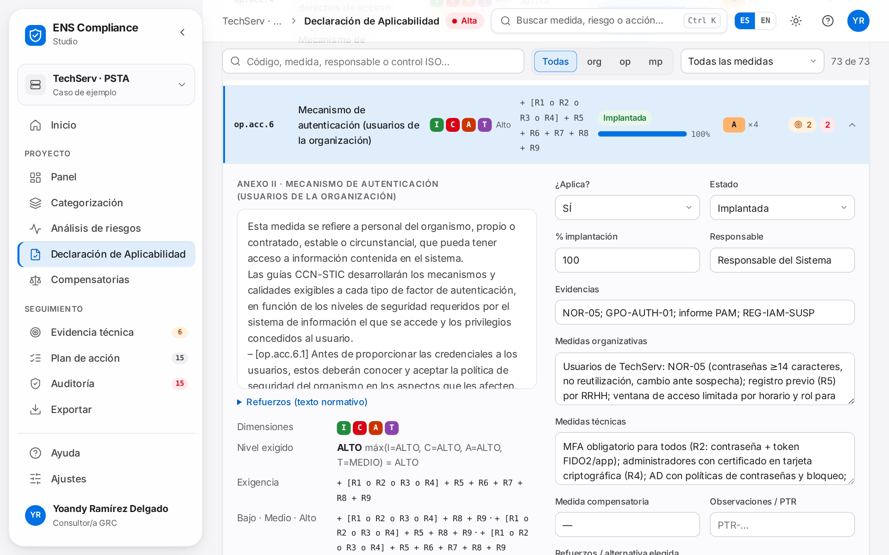<br/><sub><b>SoA</b> · op.acc.6 con su texto, exigencia, riesgos e incidencias</sub></td>
<td>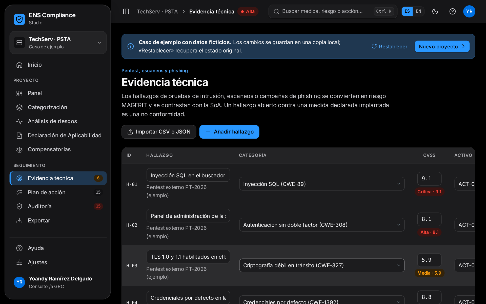<br/><sub><b>Evidencia técnica</b> · hallazgos de pentest convertidos en riesgo</sub></td>
</tr>
<tr>
<td>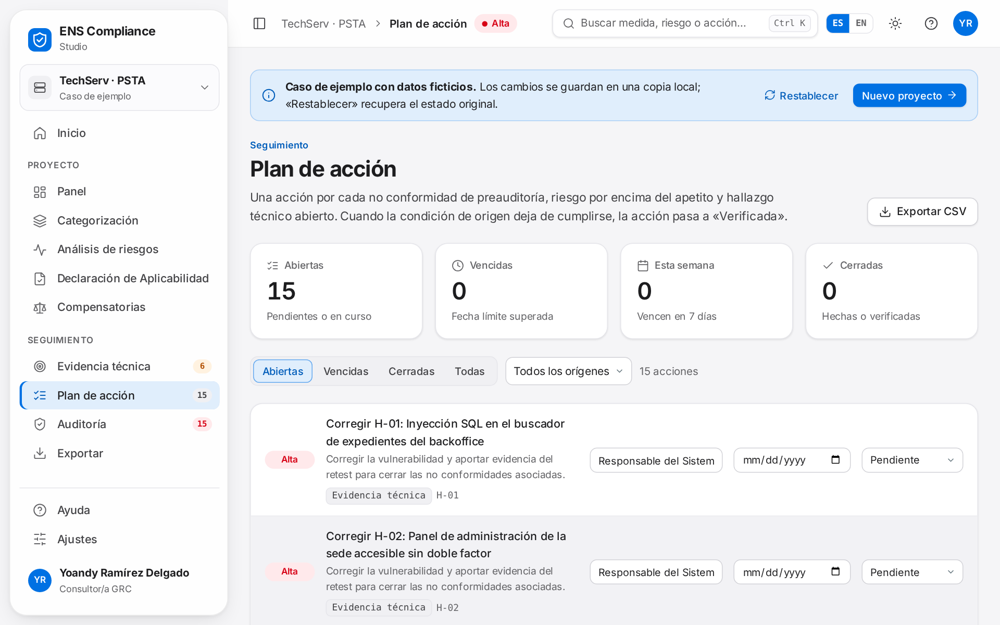<br/><sub><b>Plan de acción</b> · con responsable, fecha y verificación del cierre</sub></td>
<td>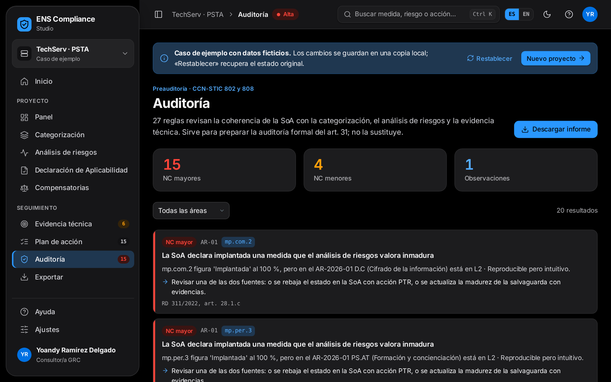<br/><sub><b>Auditoría</b> · no conformidades con referencia y acción recomendada</sub></td>
</tr>
<tr>
<td>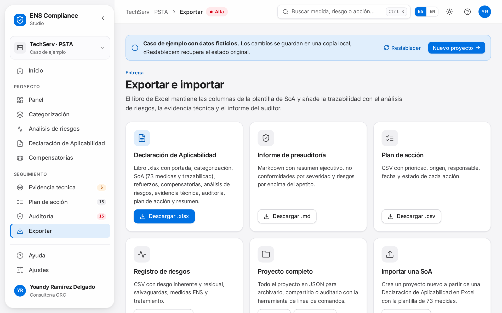<br/><sub><b>Exportar</b> · Excel, Markdown, CSV y JSON</sub></td>
<td>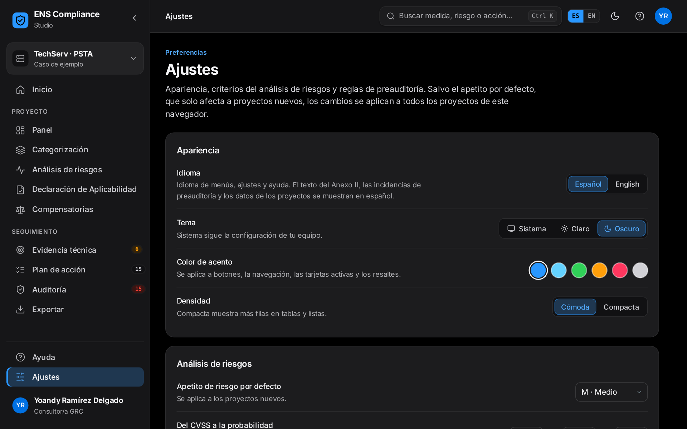<br/><sub><b>Ajustes</b> · criterios, reglas, apariencia y datos</sub></td>
</tr>
<tr>
<td colspan="2">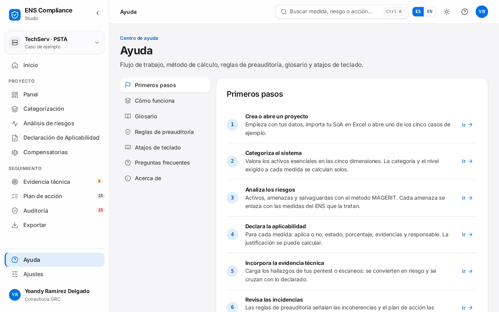<br/><sub><b>Centro de ayuda</b> · primeros pasos, flujo, glosario, reglas, atajos y preguntas frecuentes</sub></td>
</tr>
</table>

**Barra lateral.** Completa a partir de 1240 px; compacta entre 901 y 1240 px o al plegarla con el botón de la barra superior o con `[`. Flota separada de los bordes y se pliega con el botón de panel lateral de la barra superior. En compacta se despliega por encima del contenido al pasar el ratón o al llegar con el teclado, sin mover los iconos; al plegarla se pliega en el acto.

<table>
<tr>
<td align="center" width="33%">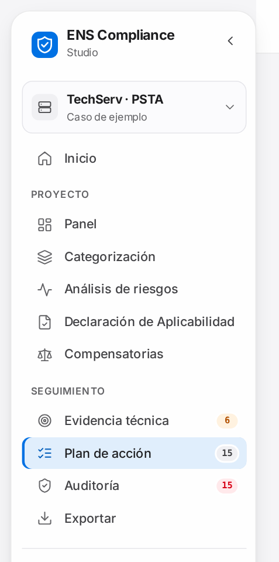<br/><sub>Completa</sub></td>
<td align="center" width="33%">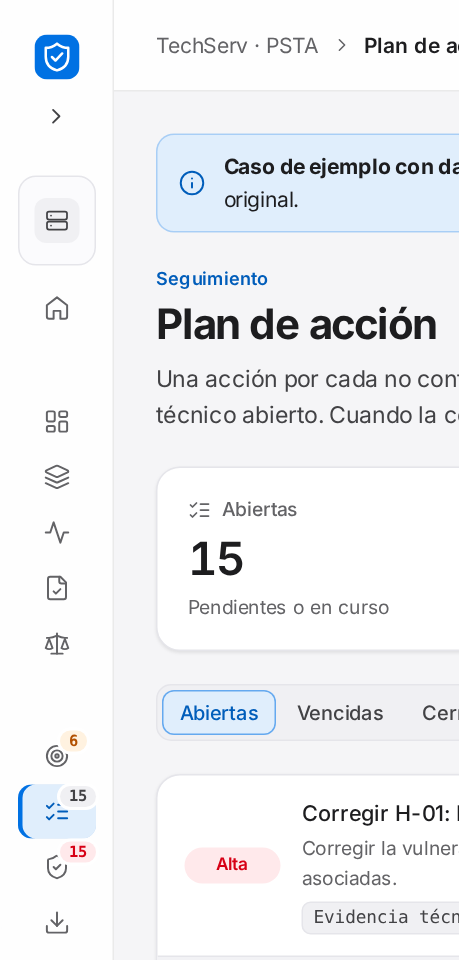<br/><sub>Compacta</sub></td>
<td align="center" width="33%">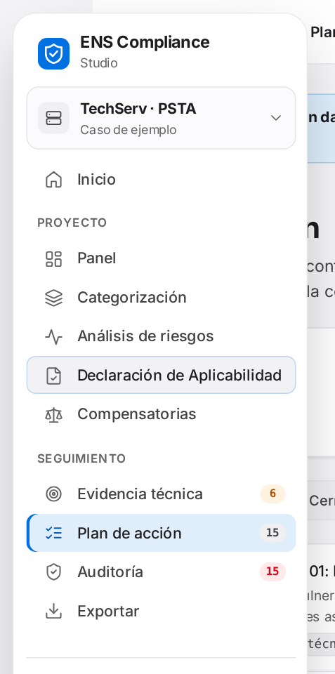<br/><sub>Compacta, al pasar el ratón</sub></td>
</tr>
</table>

**Móvil.** Por debajo de 900 px hay una barra de pestañas inferior, como la de iOS: Inicio, Panel, SoA, Auditoría (con el número de NC mayores) y Más, que abre el menú completo.

<table>
<tr>
<td align="center" width="33%">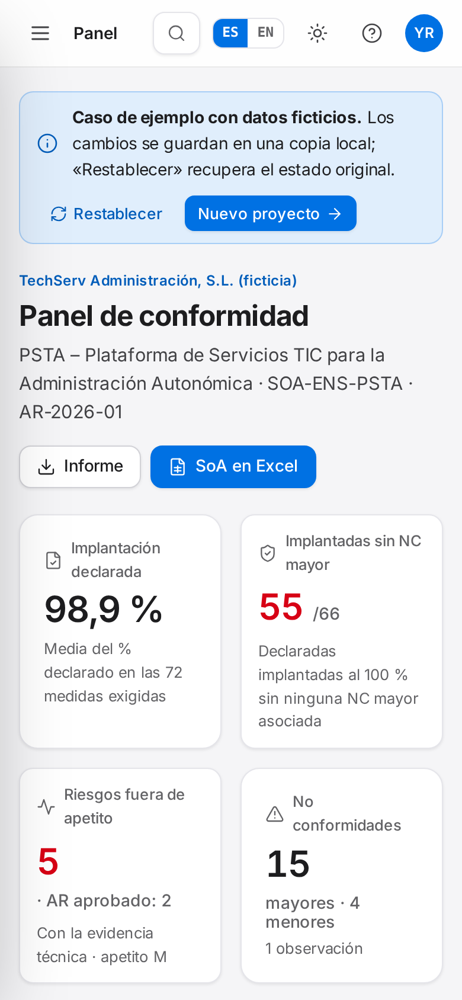</td>
<td align="center" width="33%">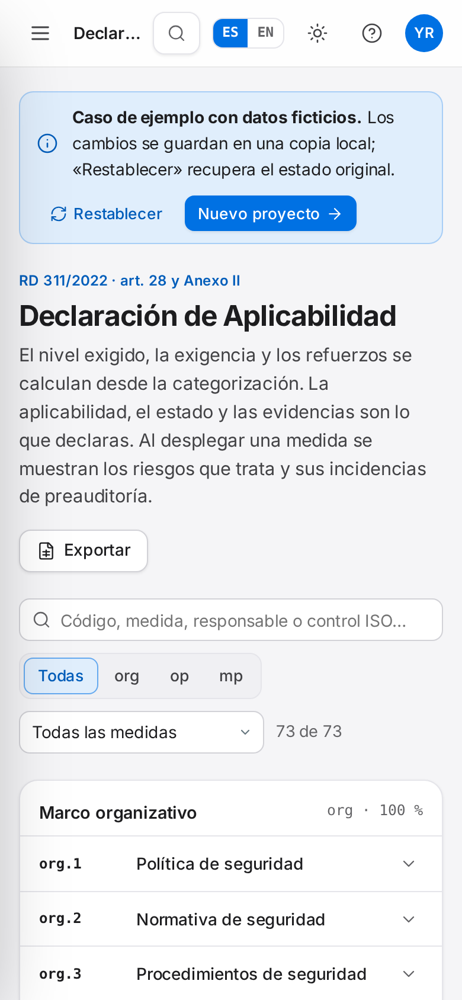</td>
<td align="center" width="33%">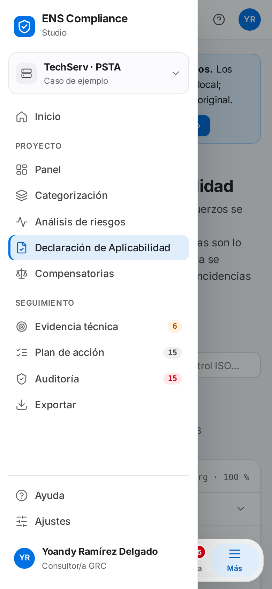</td>
</tr>
</table>

##  Lo que encuentra en el caso de clase

Sobre el Excel y el MAGERIT Lab del profesor, tal como se entregaron:

- **1 cabecera corrupta** en la hoja SoA (columna O). La disponibilidad de S-01 y S-04 viene abreviada como `m`: se lee como MEDIO y no cambia la categoría, porque I-04 ya es ALTO.
- **4 contradicciones entre la SoA y el análisis de riesgos**: medidas declaradas implantadas al 100 % cuyas salvaguardas el análisis valora en madurez L2.
- Con seis hallazgos de pentest de ejemplo: **11 no conformidades mayores** por evidencia técnica, los riesgos fuera de apetito pasan **de 2 a 5** y solo **55 de 66** medidas declaradas implantadas quedan sin objeciones.

##  Arranque rápido

```bash
# 1. Abrir la aplicación: sin instalar nada, sin conexión
open app/dist/ens-compliance-studio.html        # Windows: start app\dist\ens-compliance-studio.html

# 2. Auditar una SoA en Excel desde la terminal
pip install openpyxl defusedxml
python3 auditor/ens_soa_audit.py data/SoA_TechServ_original.xlsx --md informe.md
python3 auditor/ens_soa_audit.py mi_SoA.xlsx --fail-on mayor      # código 2 si hay NC mayores
```

<details>
<summary><b>Desarrollo</b>: reconstruir desde las fuentes y pasar todas las pruebas</summary>

```bash
# Reconstruir dist/ (Node ≥ 18, sin dependencias npm)
node app/build.js

# Entorno de pruebas (Python 3.10+)
python3 -m venv .venv && source .venv/bin/activate
pip install -r requirements.txt
playwright install chromium

# Todo: build, motor, app en navegador, accesibilidad y auditor CLI
./run_tests.sh

# Capturas del README y gráficos
python3 docs/capturas.py
node docs/assets/generar.js
```

</details>

## Ecosistema

ENS Compliance Studio comparte con el resto de herramientas GRC del autor el sobre de intercambio `yrd-ecosistema` (JSON, versión 1).

- **Exportar → Ecosistema: SoA para CTEM-Nexus y Rosetta** descarga un sobre `soa` con la categoría del sistema, los niveles por dimensión y, por cada una de las 73 medidas, si aplica, el nivel exigido, el estado, la implantación, el responsable, los riesgos que trata y los hallazgos abiertos. Lleva también la lista de activos. [CTEM-Nexus](https://heindall92.github.io/ctem-nexus/) ajusta con la categoría los plazos de corrección (en ALTA, un hallazgo crítico pasa de 3 a 2 días) y usa los activos para devolver su evidencia técnica. Ejemplo: [`tests/fixtures/studio-a-ctem.json`](tests/fixtures/studio-a-ctem.json), que la prueba del motor compara con lo que genera el motor.
- **Evidencia técnica → Importar** acepta los hallazgos que exportan CTEM-Nexus y ENS AD Auditor (`ens-studio-hallazgos`).

##  Calidad

| Suite | Herramienta | Comprobaciones | Qué demuestra |
|---|---|---|---|
| Motor | `node --test` | 16 | Paridad con el Excel (73 medidas e indicadores) y con **el código original de MAGERIT Lab**; los 5 casos; ajustes; plan de acción; sobre «soa» del ecosistema contra su ejemplo publicado. |
| Aplicación | Playwright | 102 | Flujo completo, importación del Excel del profesor, exportaciones (incluido el sobre «soa» para CTEM-Nexus y Rosetta), enlaces a las siete herramientas GRC del autor, Exportar en inglés, barra lateral, teclado y foco, ataques (XSS, contaminación de prototipos, fórmulas, almacenamiento manipulado, ficheros enormes), CSP y diseño a 390 y 768 px. |
| Accesibilidad | axe-core | 0 infracciones | WCAG 2.2 A/AA en todas las vistas, pestañas, asistente y paleta, en tema claro y oscuro, a 1440 y 390 px. |
| Auditor CLI | pytest | 11 | Resultado exacto sobre el Excel original, mutaciones controladas, **paridad Python ↔ JavaScript** e informe Markdown con carga maliciosa. |

La CI ejecuta `run_tests.sh` en cada *push* y audita la SoA de ejemplo con `--fail-on mayor`.

##  Seguridad y privacidad

Todo fichero importado se trata como hostil. Detalle y proceso de reporte en [SECURITY.md](SECURITY.md).

- **Sin red.** La versión autónoma no hace ninguna petición: usa la fuente del sistema y lleva dentro las librerías de Excel. CSP con `default-src 'none'` y `connect-src 'none'`.
- **CSP por hashes** calculada en el build: solo se ejecuta el código que sale de `build.js`. Una prueba comprueba que bloquea manejadores en línea, scripts nuevos y `fetch`.
- **Excel ajeno con SheetJS 0.20.3** (corrige CVE-2023-30533 y CVE-2024-22363); `xlsx-js-style` solo escribe el Excel propio. SRI en la versión alojada.
- **Validación por esquema** de proyectos, copias, Excel, CSV y `localStorage`: listas blancas, límites de tamaño y longitud, identificadores filtrados, números acotados.
- **Salida escapada** siempre. `Object.prototype` y `Array.prototype` congelados. Neutralización de fórmulas en CSV y de Markdown en los informes.

> **Datos sin cifrar.** Los proyectos se guardan en el `localStorage` del navegador, que comparten todas las páginas del mismo origen: los HTML abiertos desde el disco y todos los proyectos de `heindall92.github.io`. Con datos reales de una organización, usa el fichero descargado en un equipo y un perfil de navegador propios, y borra los datos al terminar (Ajustes → Borrar todos los datos).

Auditoría de seguridad, experiencia de uso y accesibilidad del 2 de octubre de 2026, con el estado de cada hallazgo: [docs/AUDITORIA_PRODUCCION.md](docs/AUDITORIA_PRODUCCION.md).

##  Estructura

```
grc_ens_compliance_studio/
├── app/
│   ├── src/engine.js        Motor sin DOM: categorización, MAGERIT, SoA, preauditoría, plan
│   ├── src/ui/*.js          Interfaz por módulos: idioma, núcleo, seguridad, iconos, shell, vistas, E/S, eventos
│   ├── src/styles.css       Tokens de diseño, tema claro y oscuro, barra lateral, responsive
│   ├── cases/               Textos de implantación y los 4 casos de ejemplo adicionales
│   ├── build.js             Genera dist/ y la CSP por hashes
│   ├── dist/                ens-compliance-studio.html: el fichero final, autónomo
│   └── vendor/              SheetJS CE 0.20.3 (lectura) y xlsx-js-style 1.2.0 (escritura), Apache-2.0
├── auditor/                 ens_soa_audit.py y anexo_ii.json: auditor CLI apto para CI
├── data/                    Material del profesor (sin modificar) y tablas de trazabilidad
├── tests/                   engine.test.js · e2e_app.py · a11y_app.py · test_auditor.py
├── docs/
│   ├── AUDITORIA_PRODUCCION.md   Estado de los hallazgos de la auditoría
│   ├── auditoria/                Informes completos de seguridad y de UX/accesibilidad
│   ├── capturas.py               Genera las capturas del README
│   ├── assets/generar.js         Genera la cabecera, los iconos y los mosaicos del README
│   └── MEMORIA.md · GUION_DEFENSA.md
├── requirements.txt         openpyxl · defusedxml · pytest · playwright (versiones fijadas)
└── run_tests.sh             Build, motor, app, accesibilidad y auditor en un solo comando
```

##  Limitaciones

- Las correspondencias amenaza/salvaguarda ↔ medida ENS (`data/mapping.json`) son criterio del autor, razonado a partir de MAGERIT v3 y la CCN-STIC 804. En un sistema real hay que revisarlas.
- La preauditoría no infiere equivalencias entre refuerzos (por ejemplo, que R2 «formal» de op.pl.1 cubra R1 «semiformal»).
- Los datos se guardan en el navegador, sin cifrar. Para trabajo en equipo haría falta un servidor con control de acceso.
- No sustituye a PILAR ni a la auditoría formal del art. 31: prepara la auditoría.

##  Licencia

[MIT](LICENSE) · © 2026 Yoandy Ramírez Delgado.

SheetJS CE y `xlsx-js-style` bajo Apache-2.0. Inter (solo para las capturas del README) bajo SIL OFL 1.1. Iconos: [Lucide](https://lucide.dev) (ISC). Texto normativo: RD 311/2022 (BOE-A-2022-7191). Los casos de ejemplo son ficticios.

Proyecto de fin de máster · Máster en Ciberseguridad & IA (Evolve Academy) · Módulo de Gobierno, Riesgo y Cumplimiento. Forma parte de un conjunto de herramientas GRC del mismo autor: [ARGOS](https://github.com/heindall92/argos-grc), laboratorio de práctica con rutas, casos prácticos y simulacros; [Rosetta](https://github.com/heindall92/rosetta_multinorma), que relaciona el ENS con ISO/IEC 27001, NIS2 e ISO/IEC 42001, y [KAIROS](https://github.com/heindall92/kairos), para la continuidad de negocio (BIA, BCP y DRP).

##  Autor

<table>
<tr>
<td align="center" width="100%" valign="top">
<br/>
<b>Yoandy Ramírez Delgado</b><br/>
<sub><b>Diseño y desarrollo de ENS Compliance Studio</b></sub><br/>
<sub>Junior Pentester · eJPTv2 · AI Governance (ISO 42001) · SysAdmin</sub><br/><br/>
<a href="https://www.linkedin.com/in/yoandyrd92/"></a>
<a href="https://github.com/heindall92"></a>
<a href="https://yoandyramirez.com"></a>
<a href="https://profile.hackthebox.com/profile/019c5812-b4ca-7315-b12f-14db6d2b42fa"></a>
</td>
</tr>
</table>

Errores, reglas discutibles o propuestas: abre una *issue* o escribe a <a href="mailto:yoandyramirezdelgado@gmail.com">yoandyramirezdelgado@gmail.com</a>. Vulnerabilidades: por el proceso de [SECURITY.md](SECURITY.md).

<p align="center">
  <picture>
    <source media="(prefers-color-scheme: dark)" srcset="docs/assets/readme/pie-dark.svg">
    
  </picture>
</p>
